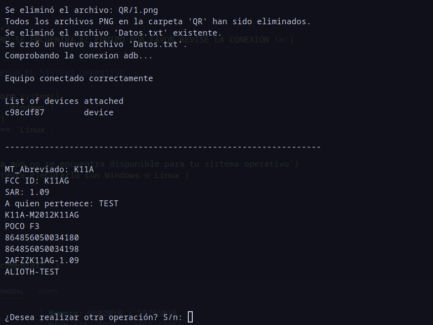

# Generador etiquetas QR teléfonos Xiaomi

Hola, este es el primer script que subo público, pueden descargarlo usarlo y modificarlo a su conveniencia.

Este programa entrega el formato para etiquetar teléfonos de la marca xiaomi o marca compatible, para etiquetas de 5X3 cm o superior, puedes usar cualquier etiquetadora lo importante es el formato


## Installation

Librerias necesarias

```bash
pip install pandas
```
```bash
pip install qrcode
```
```bash
pip install pillow
```
Debe instalar adb y añadirlo al path en caso de windows, y en arch linux usar

```bash
sudo pacman -S android-tools
```


## Como usar

Debe seguir estos pasos para usar 

- Activar el modo depuración o modo desarrollador de su equipo.
- Conectar equipo por USB.
- Ejecutar el programa.
- Llenar los datos a mano segun corresponda
- El programa elimina automaticamente los QR guardados previamente en la carpeta


**Nota:**

- No eliminar la carpeta /QR
- Puede eliminar el archivo Datos.txt generado no afectará en el funcionamiento


## Screenshots



